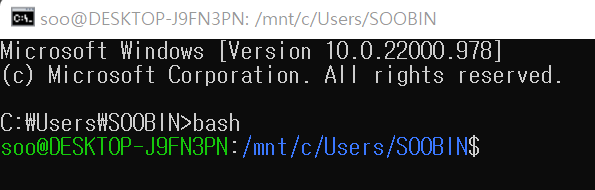

# Linux (Ubuntu 20.04.5 LTS) 사용법

### Windows에서 Ubuntu 실행하기
1.  window key + R 누른 후 cmd 창 띄우기 => Terminal 시작
2. `bash` 명령어 입력

    ▼ ubuntu 환경에서 wsl 실행 완료
    

    
1. 
코드~
사진

아파치 설치 및 실행

명령어 정리

vscode 연동 사용 시 오류 해결

아파치 서버로 웹페이지 접속 화면